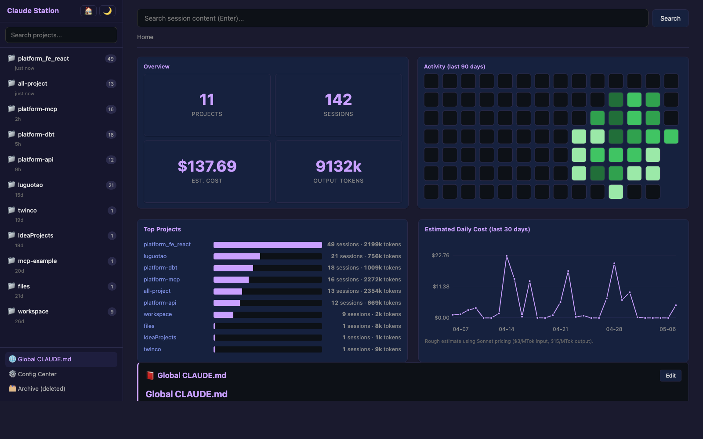
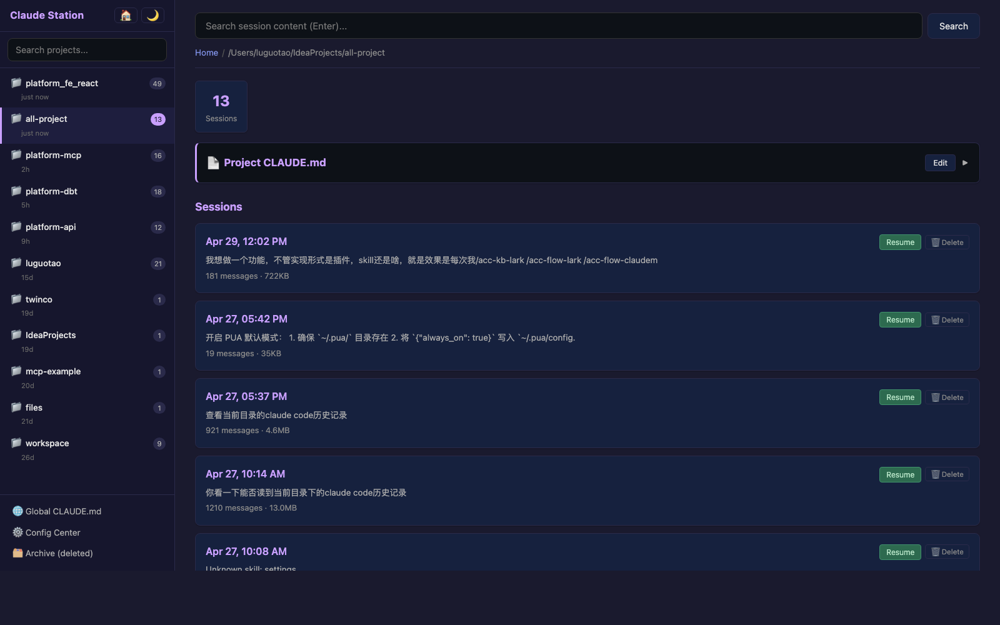
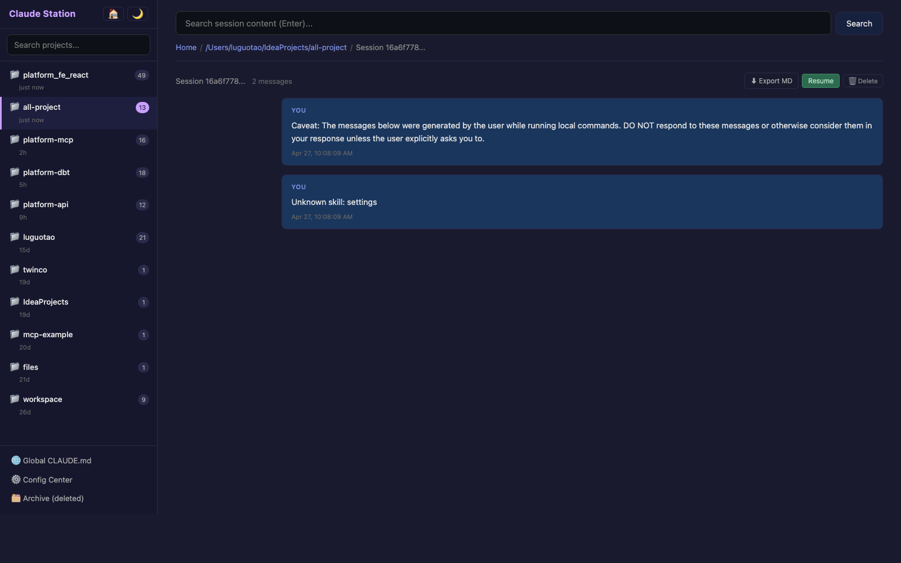
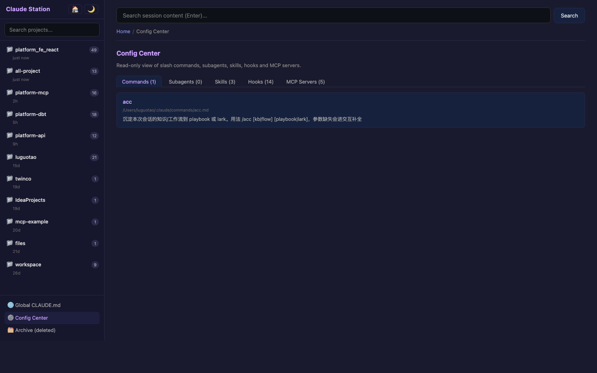
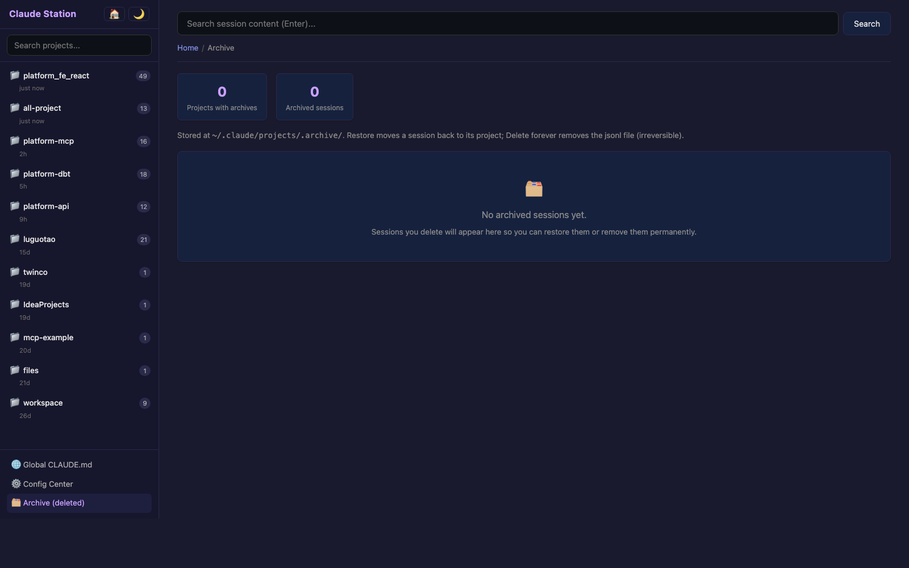

# Claude Station

> A local web dashboard to browse, search, edit and resume your Claude Code sessions — zero npm dependencies, zero build step.

[中文 README](./README.zh-CN.md)



`claude-station` reads everything from your local `~/.claude/` directory and renders it as a navigable web UI. No data leaves your machine. No build tools, no framework, no database — just Node.js standard library.

---

## Why

If you use Claude Code in many directories, your sessions, costs and configuration end up scattered across `~/.claude/`. There is currently:

- no UI to **browse past chats** across all projects
- no **search** over historical conversations
- no easy way to **resume an old session** without remembering its UUID
- no visualization of **cost / token usage / activity** over time
- no central place to **inspect commands, skills, MCP servers and hooks**

Claude Station fixes all of that in one local web app.

---

## Features

- 📁 **Project sidebar** — every directory you've used Claude Code in, sorted by last active, with project search
- 🔍 **Full-text search** across the user/assistant messages of every session
- 📊 **Dashboard** — 90-day GitHub-style activity heatmap, top-projects bar chart, daily-cost line chart with hover tooltips
- 💬 **Session viewer** — full conversation rendered as Markdown
- ▶️ **One-click resume** — copies `cd <dir> && claude --resume <id>` to your clipboard
- ✏️ **CLAUDE.md editor** — edit global and project CLAUDE.md from the browser, with timestamped `.bak` backups
- 🗑 **Delete + restore** — deleted sessions go to `~/.claude/projects/.archive/`; the **Archive page** lets you restore or permanently delete
- ⚙️ **Config Center** — read-only view of your commands, subagents, skills, hooks, and MCP servers
- 🌙 **Dark / light theme** with persistent preference
- 🔁 **Auto port fallback** — if 3456 is busy, it walks to 3457, 3458, …

---

## Screenshots

|  |  |
|---|---|
| Home dashboard | Project sessions |
|  |  |
| Session detail | Config Center |
|  |  |

Archive page (delete & restore):



---

## Install

```bash
# Run without installing (recommended)
npx claude-station

# Or clone & link locally
git clone https://github.com/<you>/claude-station.git
cd claude-station
npm link
claude-station
```

A browser tab opens at <http://localhost:3456> automatically.

> Set `PORT=8080` to start on a different port. If the port is busy, the server walks forward up to 20 times.

---

## How it works

| Source | Use |
|---|---|
| `~/.claude/projects/<escaped>/<uuid>.jsonl` | Sessions: messages, timestamps, token usage |
| `~/.claude/CLAUDE.md` | Global memory |
| `<project>/CLAUDE.md` | Per-project memory (path comes from the `cwd` field of jsonl) |
| `~/.claude/commands/`, `agents/`, `skills/` | Config Center listings |
| `~/.claude/settings.json` | Hooks, permissions |
| `~/.claude.json` | MCP servers |

The cost line chart is a **rough estimate** using Sonnet pricing (`$3/MTok input`, `$15/MTok output`). Treat it as a trend, not a bill.

---

## Privacy

- Data **stays on your machine**. Nothing is sent over the network.
- The server only listens on `localhost`.
- Editing CLAUDE.md writes a timestamped `.bak.<ISO>` next to the original before overwriting.
- Deleting a session moves the file to `~/.claude/projects/.archive/`. **Permanent delete** truly `unlink()`s — irreversible.
- Path traversal is rejected: every file write/move is validated to stay under `~/.claude/`.

---

## Tech stack

- **Backend**: Node.js standard library (`http`, `fs`, `readline`, `child_process`)
- **Frontend**: vanilla HTML + CSS + JS, `marked.js` inlined for Markdown rendering
- **Tests**: `node:test` (built-in)
- **Dependencies**: 0 npm packages

The whole app is ~1500 LOC across 6 view files, 1 scanner, 1 server. Easy to read, easy to fork, easy to extend.

---

## Development

```bash
git clone https://github.com/<you>/claude-station.git
cd claude-station

# Run
node bin/cli.mjs

# Test (uses node:test, no extra deps)
node --test test/
```

Project structure:

```
claude-station/
├── bin/cli.mjs           # entrypoint
├── src/
│   ├── scanner.mjs       # reads ~/.claude/
│   ├── server.mjs        # http routes
│   └── views/
│       ├── layout.mjs    # shared shell + CSS + JS
│       ├── home.mjs      # dashboard
│       ├── project.mjs   # session list
│       ├── session.mjs   # conversation view
│       ├── search.mjs    # full-text search
│       ├── config.mjs    # config center
│       └── archive.mjs   # deleted sessions
└── test/scanner.test.mjs
```

---

## License

MIT
